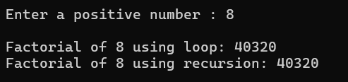
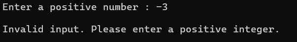
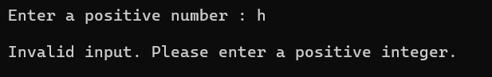

# Task 1 **Basic Data Types, Control Structures, and Methods:**

## **Objective :**
- Write a console application that calculates the factorial of a given number.

## **Requirements :**
- Read an integer from the user.
- Validate the input (ensure it’s a positive integer).
- Use loops (or recursion) to calculate the factorial.
- Display the result in the console.

## **Features :**
- Input validation using int.TryParse() to handle non-numeric and negative inputs.
- Two separate methods for calculating factorial:
  - `FactorialByLoop(int num)`
  - `FactorialByRecursion(int num)`
- Output formatted using string interpolation.

## **Example output:**

####  Valid Input (Positive Integer or Zero):

#### Invalid Input (Negative Integer):

#### Invalid Input (Non-numeric or empty):

