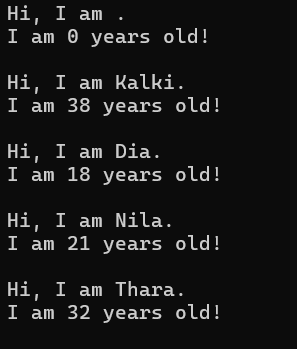

# Task 2: **Simple Object-Oriented Programming (OOP)**

## **Objective:**
- Understand and implement the fundamentals of OOP in C#.

## **Requirements:**
- Create a `Person` class with:
  - Properties: `Name`, `Age`
  - Method: `Introduce()` to display a personalized message.
- Instantiate multiple `Person` objects in the `Main` method and call `Introduce()`.

## **Concepts Used:**
- Classes and Objects
- Constructor Overloading
- Properties with Getters and Setters
- Encapsulation
- Property/Object/Shorthand Initializer Syntax
- String Interpolation

## **Features:**
- `Encapsulation` using `private` fields with public `properties`.
- Default and parameterized `constructors` to demonstrate constructor overloading.
- `Introduce()` method uses `string interpolation` to format output.
- Demonstrates multiple object creation styles:
  - Property assignment after instantiation
  - Object initializer syntax
  - Shorthand object initialization (C# 9.0+)

## **Example Output:**

