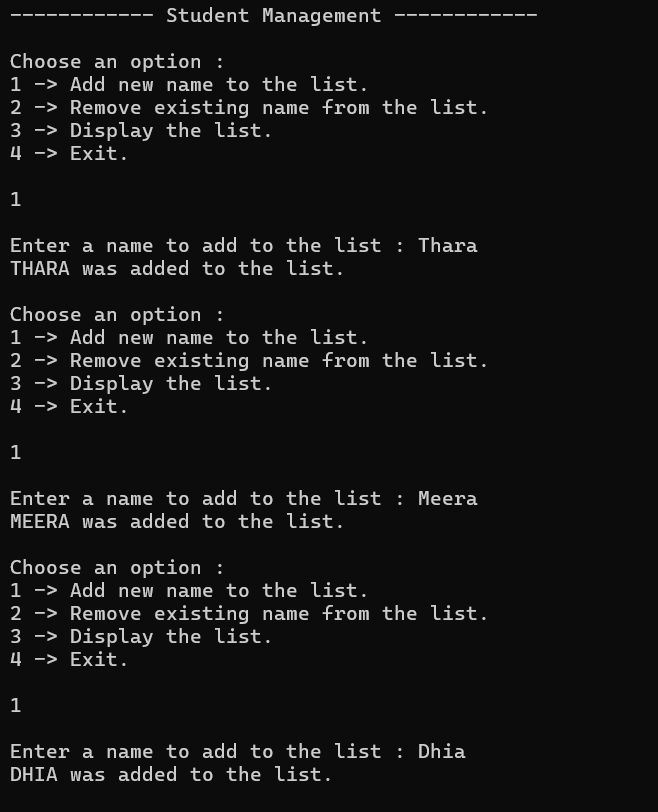
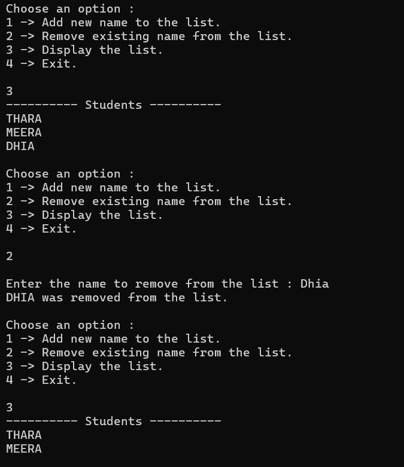
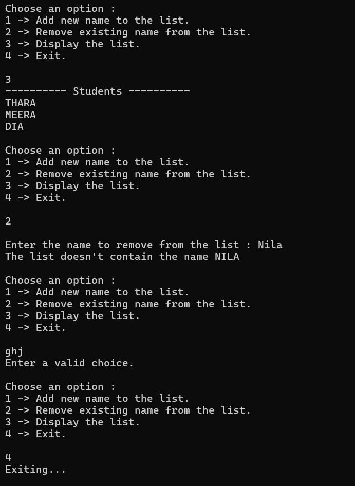

# Tssk 3 **Basic Collections and String Manipulation**
## **Objective :**
- Write a program to manage a list of strings (e.g., names or tasks).

## **Requirements:**
- Use a `List<string>` to store items.
- Allow the user to add, remove, and display items.
- Utilize loops and basic string methods (like `Trim()`, `ToUpper()`) to process user input.

## **Concepts Used:**
- Namespaces → `System.Collections.Generic` for Lists (`List<string>`)
- Loops (`while`, `foreach`)
- Conditional logic (`switch-case`)
- String methods (`Trim()`, `ToUpper()`)

## **Features:**
- Add names with validation
- Remove names only if they exist
- Display all current names
- Graceful handling of invalid inputs
- Display of the list

## **Sample Output:**

#### Add names:

#### Remove & Display names:

#### Invalid Input:

