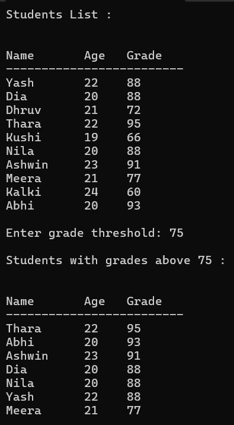

# Task 4 - **Working with Collections and LINQ**

## **Objective:**
 - Create a student management console application.

## **Requirements:**   
- Define a `Student` class with properties such as `Name`, `Grade`, and `Age`.
- Populate a collection (e.g., a `List<Student>`) with sample data.
- Use LINQ to:
    - Filter students who have a grade above a certain threshold.
    - Sort the filtered results by name or grade.
- Display the filtered and sorted list.

## **Concepts Used**
- **Class**: `Student`
- **Generic Collections**: `List<T>` from `System.Collections.Generic`
- **LINQ** methods:
  - `Where()` – filtering
  - `OrderByDescending()` – primary sort
  - `ThenBy()` – secondary sort
- **Loops**: `foreach` for displaying data
- **String formatting** using string interpolation (`$"{value,-width}"`)

## **Features**
- List of 10 students with name, age, and grade
- Displays full list of students with clean formatting
- Accepts user-defined grade threshold
- Filters students with grades above the `user-entered threshold`
- Sorts filtered results:
  - Descending by grade
  - Ascending by name
- Neatly formatted output table

## **Sample Output**

