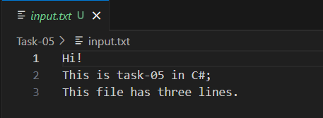
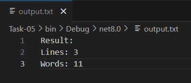

# Task 5 - **File I/O and Exception Handling**

## **Objective:**
- Develop an application that reads from and writes to files.

## **Requirements:**
- Read text from a file (e.g., a log file or a simple CSV).
- Process the data (for example, count words or lines).
- Write the result to a new file.
- Implement exception handling to manage file-related errors (such as `FileNotFoundException` or `IOException`).

## **Concepts Used:**
- System.IO.File methods:
    - ReadAllLines()
    - WriteAllText()
- Exception handling with try-catch
    - FileNotFoundException
    - IOException
    - Generic Exception 
- String methods 
    - `Split(' ', '\t')`
    - `Length`

## **Features**
- Reads and processes file content
- Counts number of lines and words
- Outputs results to a new file
- Handles common file-related errors with proper exception handling

## **Sample Output**

#### If input.txt contains:



***Note:*** 
- Ensure that input.txt is placed in the same directory as the executable (e.g., bin/Debug/net8.0) or set its Copy to Output Directory property in Visual Studio to Copy always. 
- This will ensure that the file is available at runtime, and the application will not throw a FileNotFoundException.

#### Then output.txt will contain:



#### If input.txt is not found:


## **Alternative Approach -  (StreamReader/StreamWriter):**
- Alternatively, `StreamReader` and `StreamWriter` can be used for more control over file reading and writing, especially with large files or more complex file formats. 
- Here's an example of how you could use them:

```csharp
try
{
    int linesCount = 0;
    int wordsCount = 0;

    // Reading file line-by-line
    using (StreamReader sr = new StreamReader("input.txt"))
    {
        string line;
        while ((line = sr.ReadLine()) != null)
        {
            linesCount++;
            wordsCount += line.Split(' ', '\t').Length;
        }
    }

    string result = $"Result:\nLines: {linesCount}\nWords: {wordsCount}";

    // Writing result to file
    using (StreamWriter sw = new StreamWriter("output.txt"))
    {
        sw.WriteLine(result);
    }

    Console.WriteLine(result);
}
catch (FileNotFoundException)
{
    Console.WriteLine("Input file not found.");
}
catch (IOException e)
{
    Console.WriteLine($"IO Error: {e.Message}");
}
catch (Exception e)
{
    Console.WriteLine($"Unexpected error: {e.Message}");
}
```

