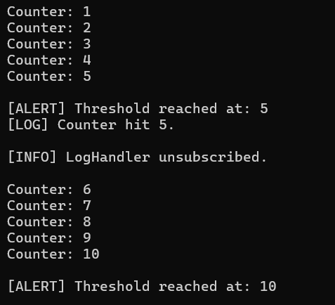

# Task 6 **Delegates, Events, and Basic Event Handling**

## **Objective:**
- Build a console-based event-driven application (e.g., a counter that triggers an event at a threshold).

## **Requirements:**
- Define a delegate and an event that fires when a counter reaches a specific value.
- Create multiple event handler methods that perform actions when the event is raised.
- In your main loop, increment the counter and raise the event when appropriate.
- Demonstrate how events can decouple the producer and consumer logic.

## **Concepts Used:**
- **Delegates**: Used to define method signatures that can be called when events are raised.
- **Events**: Mechanism to notify subscribers (handlers) when certain actions occur.
- **Subscription/Unsubscription**: Ability to add or remove event handler methods during runtime.
- **Producer-Consumer Decoupling:** Demonstrates how the producer (counter) can trigger an event, while consumers (handlers) can react independently and be changed without altering the producer.

## **Implementation:**

1. **Define a Custom Delegate:**
   - Created `ThresholdReachedHandler` delegate to define the event handler signature (taking an `int` value as parameter).

2. **Create `Counter` Class:**
   - Implemented a `Counter` class that maintains a counter (`value`), a `threshold`, and an `end` value.
   - The counter's value increments with each method call (`Increment`).
   - Defined an event `ThresholdReached` with `ThresholdReachedHandler` delegate.
   - The class raises the event `ThresholdReached` when the counter reaches the threshold or end value.

3. **Implement Event Handler Methods:**
   - Created two event handlers:
     - `AlertHandler`: Prints an alert message when the threshold is reached.
     - `LogHandler`: Logs the counter value when the threshold is reached.

4. **Event Subscription:**
   - Subscribed both `AlertHandler` and `LogHandler` to the `ThresholdReached` event of the `Counter` class.
   - Handlers were invoked each time the event was triggered.

5. **Unsubscribe Event Handler:**
   - At runtime, unsubscribed `LogHandler` when the counter reached a specific value (when `i == 4`).

6. **Threading for Slowdown:**
   - Used `Thread.Sleep(500)` to slow down the counter’s increments for observation of event handling.

7. **Producer-Consumer Decoupling:**
    - The `Counter` class (producer) triggers the `ThresholdReached` event without being tightly coupled to the consumer logic.
    - The `AlertHandler` and `LogHandler` event handler methods(consumers) are responsible for responding to the event, and they can be added or removed at runtime without modifying the `Counter` class.
    - This separation allows flexibility, as the counter logic can change independently of how the event is handled, demonstrating the ***decoupling of the producer and consumer***.

## **Output:**

