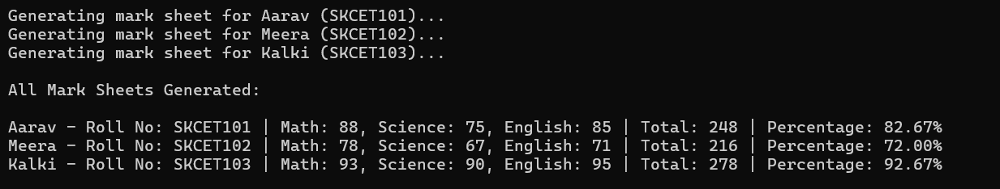

# Task 7 -  **Asynchronous Programming and Multi-threading**

## **Objective:**
- Develop a console application that performs multiple asynchronous operations concurrently.

## **Requirements:**
- Use `async` and `await` to fetch data from multiple simulated sources (e.g., using `Task.Delay` to mimic API calls).
- Aggregate the results once all tasks are complete.
- Handle exceptions that may occur during asynchronous operations.

## **Concepts Used:**

1. **Asynchronous Programming**:
   - The program uses asynchronous programming principles to perform multiple operations concurrently. 
   - The `async` and `await` keywords enable asynchronous behavior in C#.
   
2. **Task and Task.Delay**:
   - The `Task` class represents an asynchronous operation. 
   - In this program, `Task.Delay` is used to simulate a time delay, mimicking a situation where the program would be waiting for data from an external source (such as an API call or a database query).
   
3. **`async` and `await`**:
   - The `async` modifier is applied to the method (`GenerateMarksheet`), marking it as asynchronous and allowing it to perform non-blocking operations.
   - The `await` keyword is used within an asynchronous method to indicate that the program should wait for the asynchronous operation to complete before continuing with the next line of code. 

4. **Parallel Execution**:
   - The program executes multiple asynchronous tasks concurrently using a collection of tasks (`List<Task<string>>`), which are awaited all at once using `Task.WhenAll`. 
   - This allows the application to process multiple students’ mark sheets at the same time, improving performance and efficiency.

5. **Exception Handling**:
   - Exception handling is implemented to catch any potential errors that may arise during asynchronous operations

## Implementation

1. **Creating the List of Students**:
   - A list of `Student` objects is created. 
   - Each student has a `Name` and a `RollNo`.

2. **Asynchronous Task Creation**:
   - A `List<Task<string>>` is used to store the asynchronous tasks.
   - Each student’s mark sheet is generated asynchronously by calling `GenerateMarksheet` for each student in the list.

3. **Simulating the Mark Sheet Generation**:
   - The `GenerateMarksheet` method is an asynchronous method that simulates the generation of a mark sheet for each student.
   - It uses `Task.Delay(2000)` to simulate a processing delay.

4. **Task Aggregation and Result Collection**:
   - `Task.WhenAll(tasks)` is used to wait for all the tasks to complete.
   -  Once all the asynchronous operations are finished, the results are returned as an array (`results[]`).

5. **Exception Handling**:
   - A `try-catch` block is used to handle any potential exceptions that could occur during asynchronous execution. 

## **Output:**

