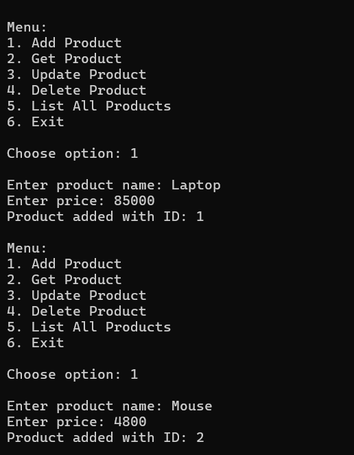
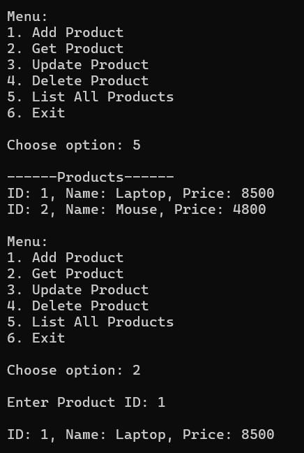
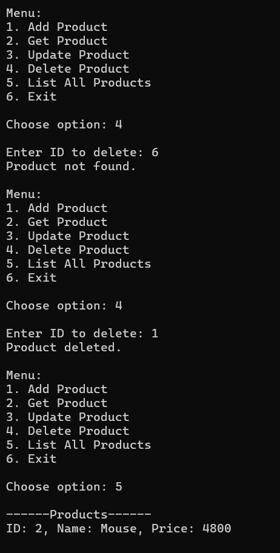
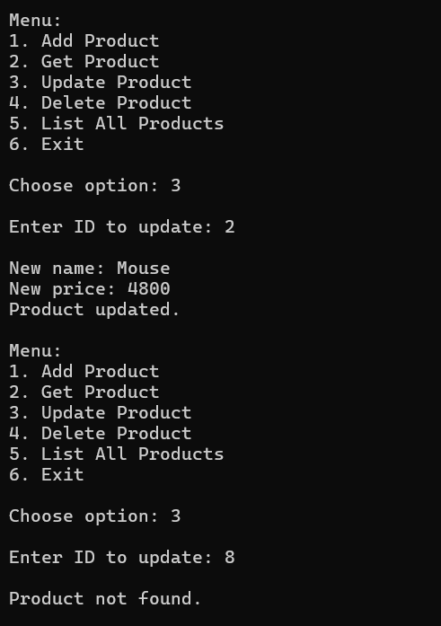

# **Task 8: Generics and Interfaces with a Repository Pattern**

## **Objective:**
- Implement a generic in-memory repository to perform CRUD operations.

## **Requirements:**
- Define an interface (e.g., `IRepository<T>`) with methods like `Add`, `Get`, `Update`, and `Delete`.
- Create a generic class that implements this interface.
- Use type constraints if necessary (e.g., where `T : class` or implementing a specific interface).
- Write a simple console UI to demonstrate the repository with a sample entity (e.g., `Product` or `Student`).

## **Concepts Used:**

### C# Generics
- Used **generics** to write reusable, type-safe code
- Allowed `Repository<T>` to work with any class implementing `IEntity`

### Interface Design
- Defined a **generic interface `IRepository<T>`**
  - Standard method signatures: `Add`, `Get`, `Update`, `Delete`, `GetAll`
- Implemented the interface in a class, keeping logic modular and testable

### Repository Pattern
- Separated **data access logic** from business logic using the **repository pattern**
- Promoted **clean architecture** by abstracting CRUD operations

### In-Memory Data Handling
- Used **`Dictionary<int, T>`** to simulate a database
- Eliminated the need for external storage — everything runs in memory

## **Implementation:**

### 1. Created a Generic Interface (`IRepository<T>`)
- Defined operations like `Add`, `Get`, `Update`, `Delete`, and `GetAll`

### 2. Implemented the Interface with a Generic Class (`Repository<T>`)
- Used `Dictionary<int, T>` for in-memory storage
- Applied a type constraint: `where T : class, IEntity`
- Auto-generated IDs using a private counter

### 3. Used a Sample Entity (`Product`)
- Created a `Product` class with properties: `Id`, `Name`, `Price`
- Implemented the `IEntity` interface to ensure consistency

## **Features:**
- Console-based interactive menu for CRUD operations
- Reusable for any entity implementing `IEntity`
- No external dependencies or database setup needed
- Clear output messages for each operation (e.g., added, updated, deleted)
- Extensible: Easily adaptable for other types like `Student`, `Customer`, etc.

## **Sample Output:**

### 1. Add

### 2. Get and GetAll

### 3. Delete

### 4. Update

