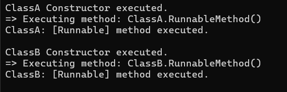

# **Task 9 - Reflection and Custom Attributes**

## **Objective:**
- Build an application that discovers and executes methods based on custom attributes.

## **Requirements:**
- Define a custom attribute (e.g., `[Runnable]`).
- Create several classes with methods decorated with the `[Runnable]` attribute.
- Use reflection to scan the current assembly for methods marked with `[Runnable]`.
- Invoke the discovered methods dynamically and display their outputs.

## **Concepts and Methods Used**

### 1. Custom Attributes
- Custom attributes allow you to define metadata that can be attached to code elements.
- You can define your own attribute by inheriting from the `Attribute` class. 
- `[AttributeUsage(AttributeTargets.Method)]` specifies that the attribute can only be applied to methods.

```csharp
[AttributeUsage(AttributeTargets.Method)]
public class RunnableAttribute : Attribute { }
```

### 2. Reflection
- Reflection is a powerful feature in C# that allows you to inspect and interact with types, methods, properties, and other members of an assembly at runtime. 
- This means that you can analyze the structure of your program while it’s running, without needing to explicitly define or hardcode that information. 
- Reflection can be used to dynamically load types, invoke methods, or access fields and properties, even if their names or signatures are not known at compile-time.

### 3. LINQ 
- LINQ is used to filter only those public methods which are decorated with `[Runnable]`.
- It simplifies code and enhances readability.

```csharp
var methods = type.GetMethods(BindingFlags.Instance | BindingFlags.Public | BindingFlags.DeclaredOnly)
                  .Where(m => m.GetCustomAttribute<RunnableAttribute>() != null);
```
- Skipped inherited methods by using `BindingFlags.DeclaredOnly`.


### 4. Dynamic Method Invocation
- Once the `[Runnable]` methods are filtered, they are invoked dynamically using `MethodInfo.Invoke()`.

```csharp
method.Invoke(instance, null);
```

#### Key Classes and Methods Used:

| Concept                          | Description                                                                 | Example Usage                                                      |
|----------------------------------|-----------------------------------------------------------------------------|--------------------------------------------------------------------|
| `[AttributeUsage]`               | Specifies how a custom attribute can be applied.                           | `[AttributeUsage(AttributeTargets.Method)]`                        |
| `AttributeTargets.Method`        | Indicates the attribute can be applied to methods.                         | `AttributeTargets.Method`                                          |
| `Attribute`                      | Base class for defining custom attributes.                                 | `public class RunnableAttribute : Attribute { }`                   |
| `Assembly.GetExecutingAssembly()`| Gets the currently executing assembly (the compiled code).                 | `Assembly assembly = Assembly.GetExecutingAssembly();`             |
| `assembly.GetTypes()`           | Gets all the types (classes, interfaces, etc.) in the assembly.            | `foreach (Type type in assembly.GetTypes())`                       |
| `type.IsClass`                  | Checks if the type is a class.                                             | `if (!type.IsClass)`                                               |
| `type.IsAbstract`               | Checks if the class is abstract.                                           | `if (type.IsAbstract)`                                             |
| `Activator.CreateInstance(type)` | Dynamically creates an object of the specified type at runtime.            | `object? instance = Activator.CreateInstance(type);`               |
| `type.GetMethods(...)`          | Retrieves the methods declared in a class with specific visibility.        | `type.GetMethods(BindingFlags.Instance | BindingFlags.Public | BindingFlags.DeclaredOnly)` |
| `BindingFlags`                  | Flags used to filter methods/properties based on visibility and scope.     | `BindingFlags.Instance | BindingFlags.Public | BindingFlags.DeclaredOnly` |
| `.Where(predicate)` (LINQ)      | Filters a collection based on a condition.                                 | `.Where(m => m.GetCustomAttribute<RunnableAttribute>() != null)`  |
| `.Any()` (LINQ)                 | Checks if any element satisfies the condition.                             | `if (methods.Any())`                                               |
| `MethodInfo`                    | Provides metadata and access to method functionality.                      | `foreach (MethodInfo method in methods)`                           |
| `method.GetCustomAttribute<T>()`| Checks if the method has the specified attribute.                          | `method.GetCustomAttribute<RunnableAttribute>()`                   |
| `method.Invoke(instance, null)` | Invokes the method dynamically at runtime.                                 | `method.Invoke(instance, null)`                                    |

## **Features:**
- Defines a custom method attribute: [Runnable]
- Implements two example classes (ClassA and ClassB)
- Marks specific methods in those classes with [Runnable]
- Uses reflection to:
    - Scan all types in the current assembly
    - Create instances of classes.
    - Find public methods marked with [Runnable]
    - Dynamically invoke those methods

## **Sample Output:**

