# Task 10 - **Building a Mini Microservice with ASP.NET Core**

## **Objective:**
- Create a small RESTful API that manages a resource (e.g., Products, Orders, or Books) using ASP.NET Core.

## **Implementation:**

### Project Setup
- ASP.NET Core Web API template used
- RESTful routing configured using `[Route("api/[controller]")]`

### Services and Dependency Injection
- `IBookService` and `BookService` handle business logic
- Registered using `AddScoped()` in `Program.cs`

### Data Access
- Entity Framework Core with **In-Memory Database**
- `AppDbContext` registered in `Program.cs`

### CRUD Functionality
- Resource: `Book` model with properties: `Id`, `Title`, `Author`, `PublishedYear`
- API Endpoints (in `BooksController.cs`):
  - `GET /api/books` – List all books
  - `GET /api/books/{id}` – Get a specific book by ID
  - `POST /api/books` – Add a new book
  - `PUT /api/books/{id}` – Update a book by ID
  - `DELETE /api/books/{id}` – Delete a book by ID

### Exception Handling
- Global `ExceptionMiddleware` catches unhandled exceptions
- Returns structured error response:

```json
{
"message": "Internal Server Error",
"details": "Exception Message Here"
}
```

### Logging
- Logs generated using `ILogger<T>` in both Controller and Service
- Includes info logs for operations and warnings for not found cases

### Swagger Integration
- Swagger UI enabled for API documentation and testing
- Available at `/swagger` in development environment


## **Output:**

### **Swagger UI**

- URL: https://localhost:{port}/swagger
- All available API endpoints for Book CRUD operations displayed via Swagger.

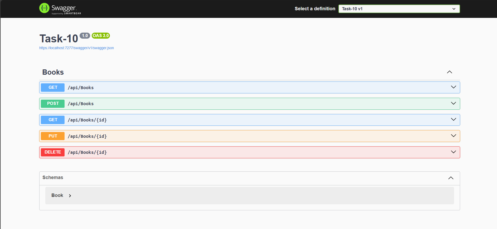


### **POST**

- Request to add a new book.

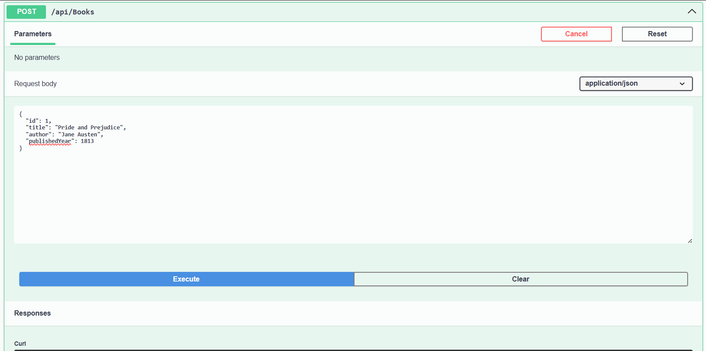

- Successful creation of a book with returned JSON response.

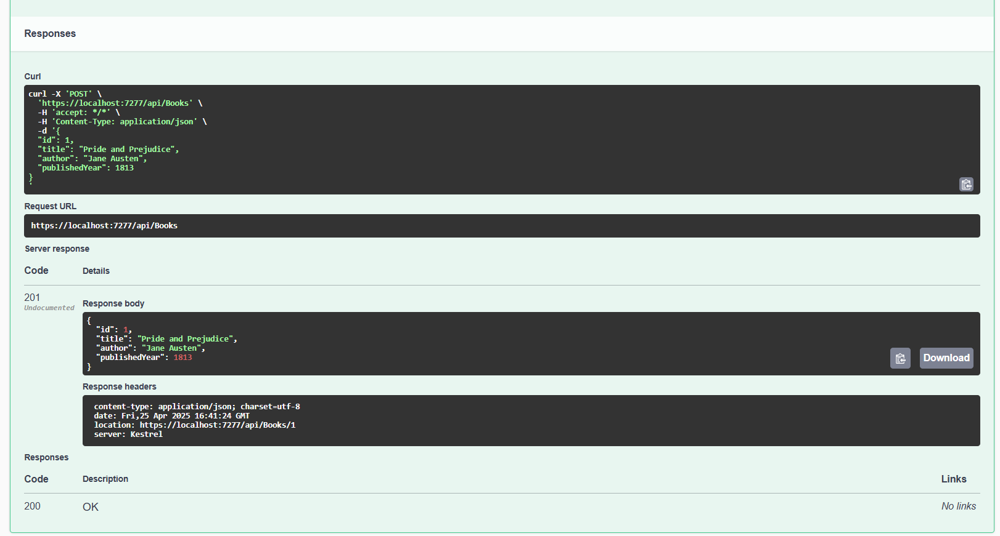

- Log showing book addition.

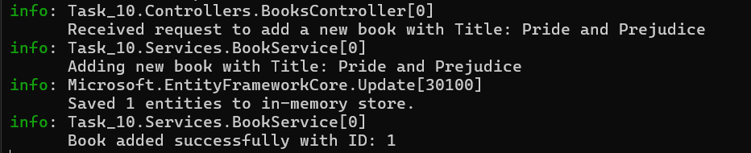

### **GET**

- Displays a list of all books currently stored.

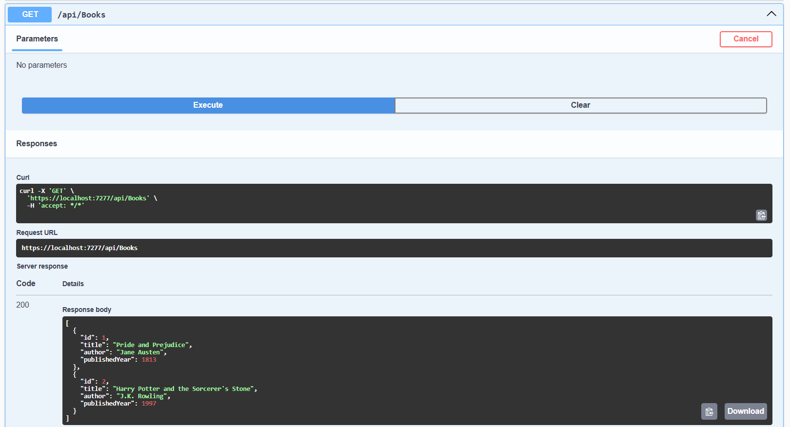

- Log showing fetch operation for all books.

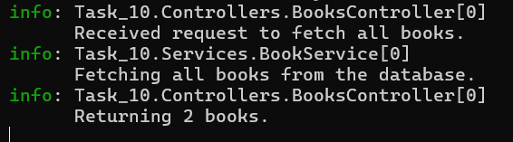

### **GET BY ID**

- Fetches a single book by ID.

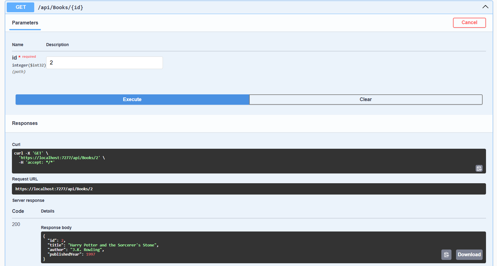

- Log confirming the fetch request for a specific book.

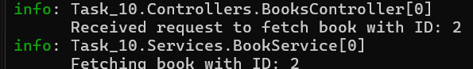

### **UPDATE**

- Request to update a book’s details.

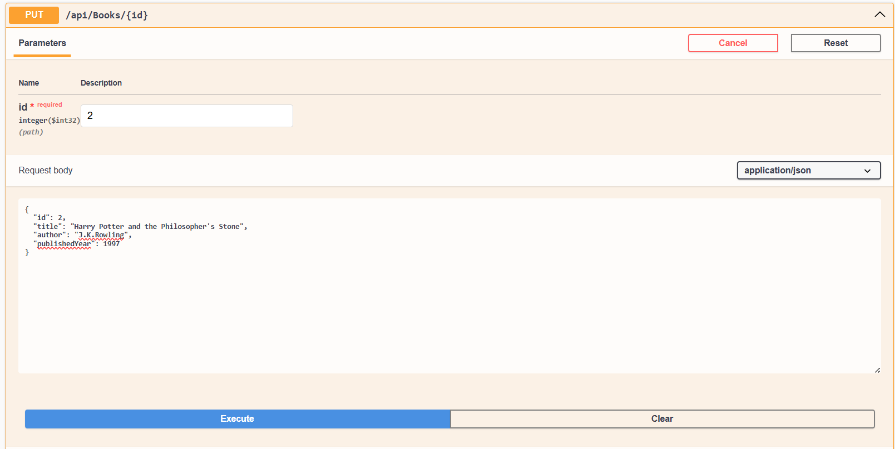

- Response for successful update.

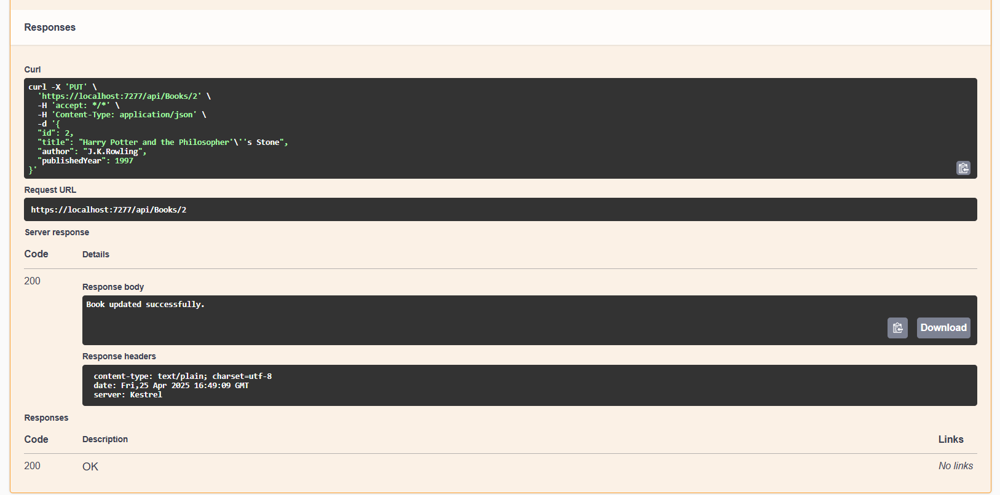

- Log of the update operation.

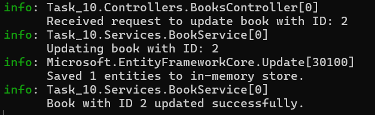

### **DELETE**

- Delete operation on a book using its ID.

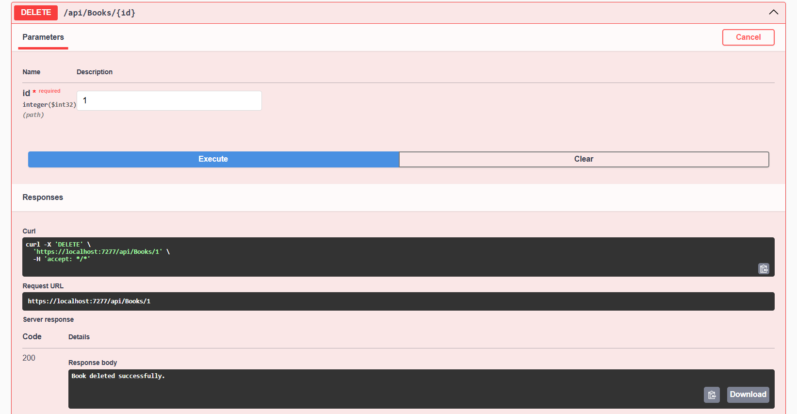

- Log confirming successful deletion.

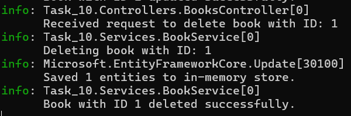

### **EXCEPTION**

- Triggering Exception via Invalid PUT

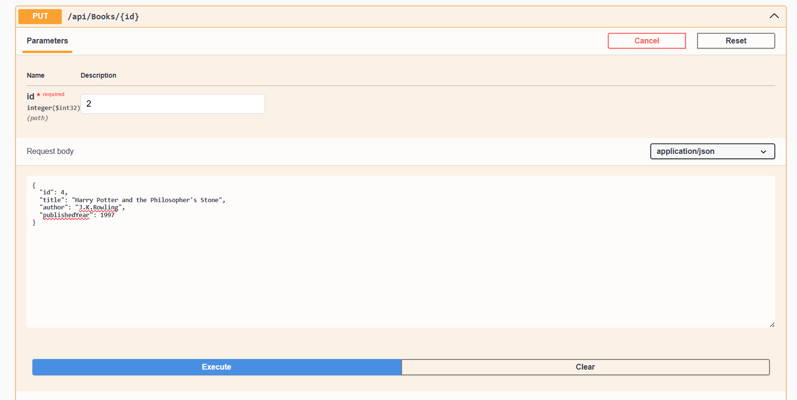

- Exception Response from Middleware

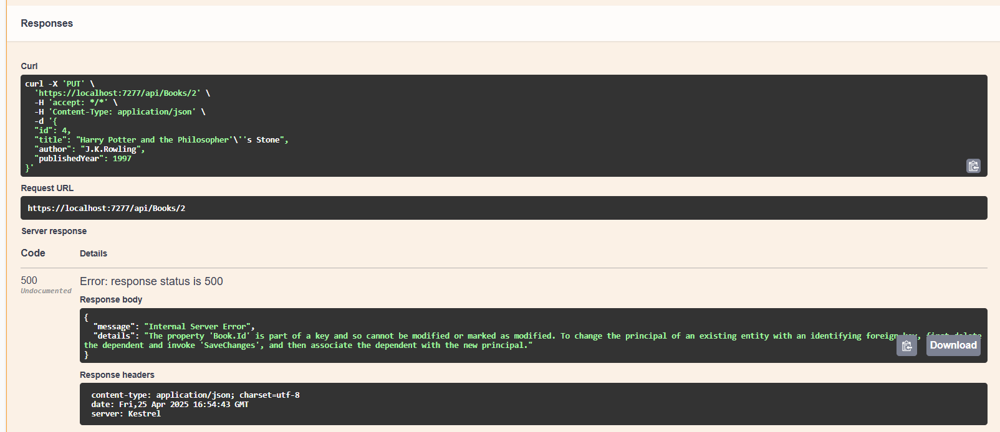

- Detailed exception logged by the middleware for debugging.

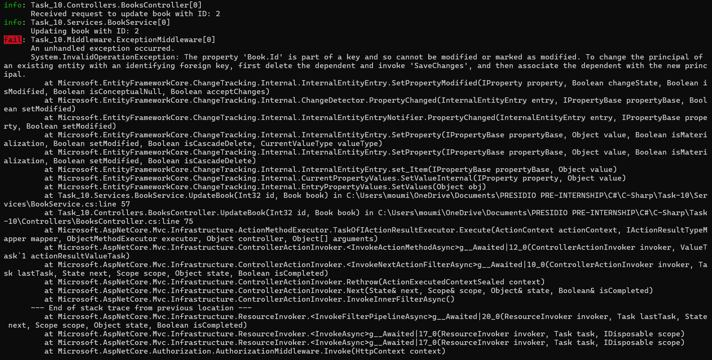